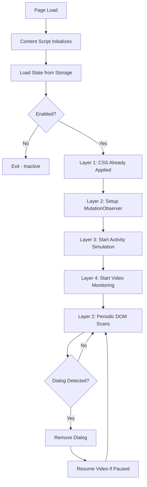

# Architecture

## Overview

YouTube Uninterrupted is a Firefox extension that prevents YouTube from interrupting video playback with the "Continue watching?" dialog. This document explains the technical architecture and implementation details.

## Core Mechanisms

The extension implements a **three-layer defense system** to ensure the dialog never appears:

### Layer 1: CSS Injection (Instant Hiding)

The first line of defense uses CSS to hide the dialog before it can be rendered.

**How it works**:
- CSS file injected at `document_start` (before page renders)
- Uses `!important` flags to override inline styles
- Targets multiple selectors for resilience

**Code location**: `content-scripts/inject-styles.css`

**Example**:
```css
ytd-popup-container,
tp-yt-paper-dialog,
[role="dialog"] {
  display: none !important;
  visibility: hidden !important;
}
```

**Why effective**: CSS is applied immediately, before JavaScript even loads, providing instant protection.

### Layer 2: DOM Monitoring (Reactive Removal)

A MutationObserver actively watches for dialog insertion and removes it immediately.

**How it works**:
- `MutationObserver` watches entire document for changes
- Detects when dialog elements are added to DOM
- Verifies element is the pause dialog (not other popups)
- Removes dialog using multiple strategies

**Code location**: Lines 378-433 in `content-scripts/youtube-uninterrupted.js`

**Detection Strategy**:
1. Check element matches dialog selectors
2. Verify text content contains pause/continue patterns  
3. Look for "Continue" button presence
4. Check aria-label and aria-describedby attributes
5. Exclude protected elements (settings, player controls)

**Removal Strategy**:
1. Click "Continue" button if found (cleanest)
2. Hide with CSS (`display: none`, `visibility: hidden`)
3. Remove from DOM after timeout
4. Hide any backdrop/overlay elements

**Performance**: Debounced callbacks (50ms) prevent excessive CPU usage.

### Layer 3: Activity Simulation (Proactive Prevention)

Simulates user activity to prevent the dialog from triggering in the first place.

**How it works**:
- Dispatches `mousemove` events every 60 seconds
- Uses random coordinates within viewport
- Occasionally dispatches `scroll` events for variety
- Targets both document and video player element

**Code location**: Lines 443-484 in `content-scripts/youtube-uninterrupted.js`

**Why needed**: YouTube tracks user inactivity and shows the dialog after ~2 hours of no interaction. Simulated activity resets this timer.

**Security**: Uses `crypto.getRandomValues()` for random coordinates (no `Math.random()`).

### Layer 4: Video State Monitoring

Monitors video state and automatically resumes playback if paused by the dialog.

**How it works**:
- Checks video element state every 2 seconds
- If paused and dialog found, resumes playback
- Tracks when dialogs are handled (timestamp)
- Only resumes if dialog was recently detected/removed

**Code location**: Lines 501-535 in `content-scripts/youtube-uninterrupted.js`

**Why needed**: Backup layer in case dialog appears and pauses video before being removed.

## Communication Architecture

The extension uses three components that communicate via browser messaging:

### Content Script (`youtube-uninterrupted.js`)
- Runs on every YouTube page
- Implements the 3-layer defense system
- Listens for state changes from background script
- Reports activity (optional, for future features)

### Background Service Worker (`service-worker.js`)
- Manages extension state (enabled/disabled)
- Stores user preferences in browser storage
- Relays messages between popup and content scripts
- Single source of truth for extension state

### Popup UI (`popup/*`)
- User interface for toggle control
- Queries background for current state
- Sends toggle commands to background
- Updates UI based on current page/state

**Message Flow**:
```
User clicks toggle in popup
    ↓
popup.js sends {action: 'setState', enabled: true}
    ↓
service-worker.js updates storage
    ↓
service-worker.js broadcasts {action: 'toggleState', enabled: true}
    ↓
youtube-uninterrupted.js receives message
    ↓
CONFIG.enabled updated, layers activate/deactivate
```

## Code Flow Diagram



## Configuration System

All behavior is controlled through a centralized `CONFIG` object:

```javascript
const CONFIG = {
  enabled: true,                          // Extension on/off
  DIALOG_SELECTORS: [...],                 // CSS selectors for dialog
  CONTINUE_BUTTON_SELECTORS: [...],        // Button selectors
  DIALOG_TEXT_PATTERNS: [...],             // Text patterns for verification
  PROTECTED_SELECTORS: [...],              // Elements to never hide
  MUTATION_DEBOUNCE_MS: 50,                // Performance tuning
  ACTIVITY_INTERVAL_MS: 60 * 1000,         // 1 minute
  VIDEO_CHECK_INTERVAL_MS: 2000,           // 2 seconds
  SCAN_INTERVAL_MS: 5000,                  // 5 seconds
  DEBUG: false                             // Console logging
};
```

## Performance Characteristics

### Memory Usage
- **Content Script**: ~2-3 MB
- **Background Worker**: ~1 MB
- **Total**: < 5 MB
- No memory leaks (all timers/observers cleaned up)

### CPU Usage
- **Idle**: Negligible (~0%)
- **Active Monitoring**: < 1%
- **Dialog Removal**: Brief spike < 2%, instant recovery
- Debounced callbacks minimize excessive checks

### Network Impact
- **Zero network requests**
- All processing is local
- No external dependencies
- No telemetry or tracking

### Battery Impact (Mobile)
- Optimized intervals (60s for activity, 2s for video check)
- Event-driven architecture (not continuous polling)
- Minimal battery drain

## Security Considerations

### Permissions
- `storage`: Save user preferences (enabled/disabled state)
- `*://*.youtube.com/*`: Access YouTube pages to inject scripts

**No other permissions requested**. No access to:
- Browsing history
- Other websites
- Webcam/microphone
- Downloads

### Content Security Policy
- No `eval()` usage
- No inline scripts
- No external script loading
- All code is static and auditable

### Privacy
- **Zero data collection**
- **No network requests**
- **No tracking or analytics**
- **Open source** - all code is public

### Safe DOM Manipulation
- All querySelector wrapped in try/catch
- Protected elements whitelist prevents accidents
- Multiple verification steps before removal

## Resilience Strategies

### YouTube UI Changes
The extension uses **multiple selectors** and **text pattern matching** to remain resilient against YouTube updates:

1. **Selector Arrays**: 10+ different selectors for dialog
2. **Text Patterns**: Matches "continue watching", "still watching", etc.
3. **Button Detection**: Multiple button selector strategies
4. **Attribute Checking**: Checks aria-label, aria-describedby

### Debug Mode
Developers can enable detailed logging:
```javascript
CONFIG.DEBUG = true;  // Enable console logging
```

Provides visibility into:
- Initialization steps
- Dialog detection  
- Removal strategies applied
- Activity simulation timing

## Limitations

1. **YouTube Only**: Extension only works on *.youtube.com domains
2. **Firefox Only**: Uses browser.* API (Firefox WebExtension)
3. **Not a Background Playback Solution**: For background playback, use [Play YouTube Video In Background](https://github.com/LabinatorSolutions/play-youtube-video-in-background)
4. **YouTube App**: Does not work in mobile YouTube app (only Firefox browser)

## Complementary Extension

For complete uninterrupted YouTube experience, pair with:

**[Play YouTube Video In Background](https://github.com/LabinatorSolutions/play-youtube-video-in-background)**
- Enables background playback when tab is minimized
- Page Visibility API override
- MediaSession integration for mobile
- Focuses on playback continuity (this extension focuses on dialog removal)
- Together they provide seamless, uninterrupted experience

## Future Enhancements

Potential improvements:

1. **Statistics Tracking**: Count dialogs blocked
2. **Customizable Intervals**: User-configurable activity timing
3. **Whitelist Mode**: Disable on specific channels
4. **Additional Dialogs**: Detect and remove other YouTube interruptions
5. **Machine Learning**: Adaptive selector detection

## Technical References

- [MutationObserver API (MDN)](https://developer.mozilla.org/en-US/docs/Web/API/MutationObserver)
- [WebExtensions Storage API](https://developer.mozilla.org/en-US/docs/Mozilla/Add-ons/WebExtensions/API/storage)
- [WebExtensions Messaging](https://developer.mozilla.org/en-US/docs/Mozilla/Add-ons/WebExtensions/API/runtime/sendMessage)
- [Content Scripts (MDN)](https://developer.mozilla.org/en-US/docs/Mozilla/Add-ons/WebExtensions/Content_scripts)
- [Web Crypto API](https://developer.mozilla.org/en-US/docs/Web/API/Web_Crypto_API)
